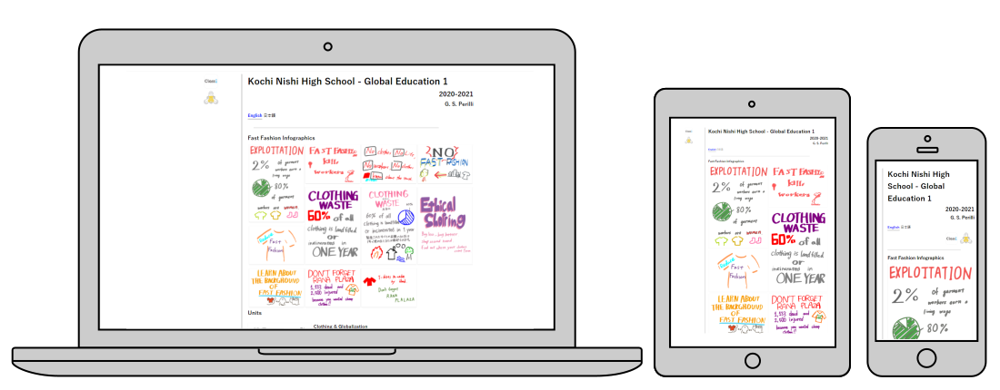

# knhs-ge1

 

[knhs-ge1](https://gperilli.github.io/knhs-ge1/index) is a site developed to curate my course materials and student work at Kochi Nishi High School, Japan. The GE1 course was an English language course with a focus on global issues as its subject matter.

# Licence & Permissions

knhs-ge1 is not commercial. My code is under the CC BY-NC-SA 4.0 licence. Please use it, share it, change it etc.. If it still resembles my code, attribute it.

[Gareth Perilli](https://gperilli.github.io/port/index.html)
